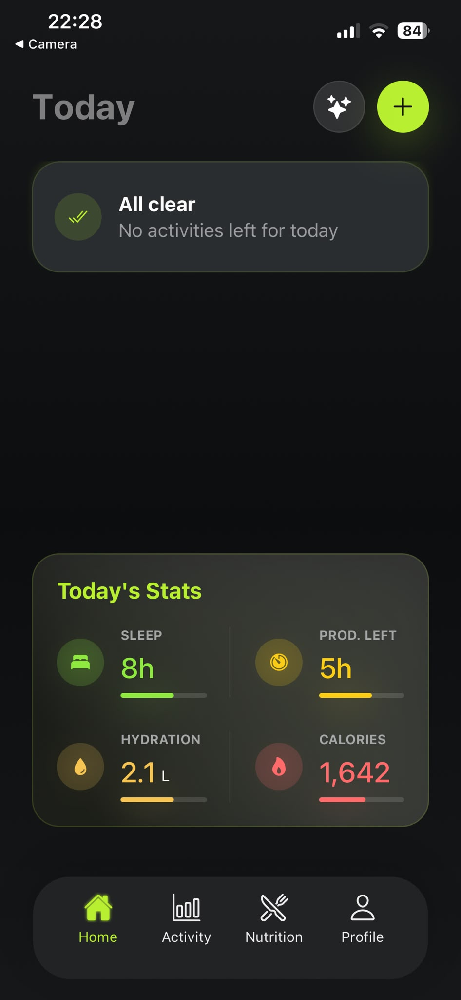
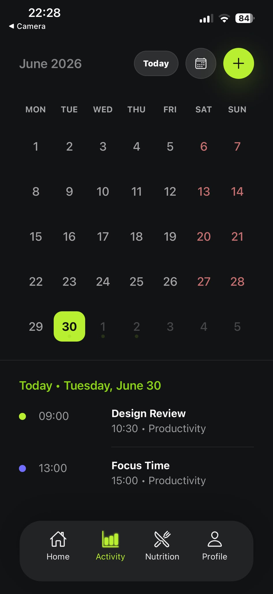
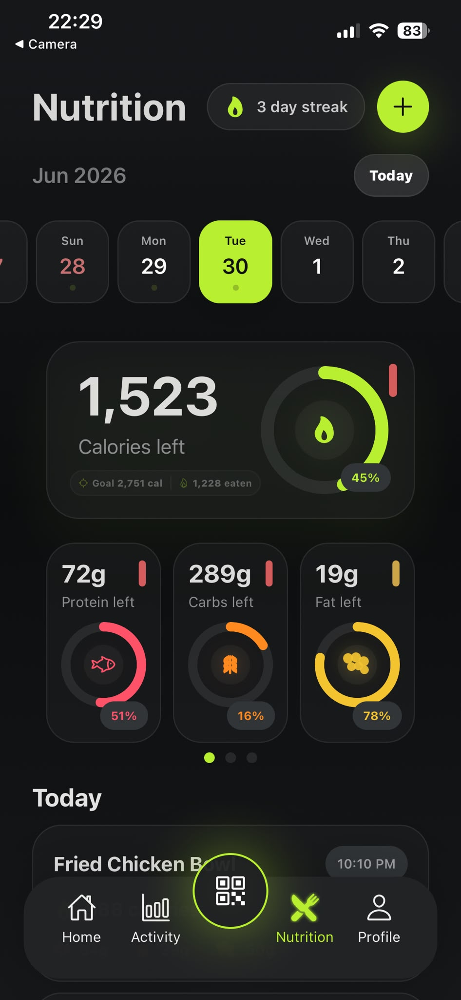
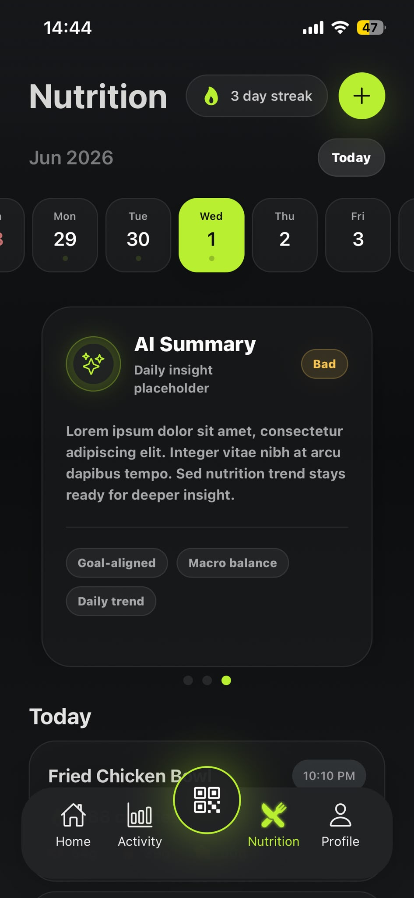
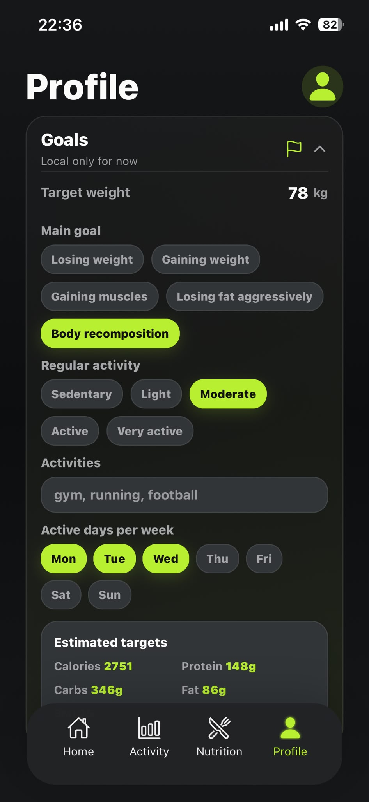
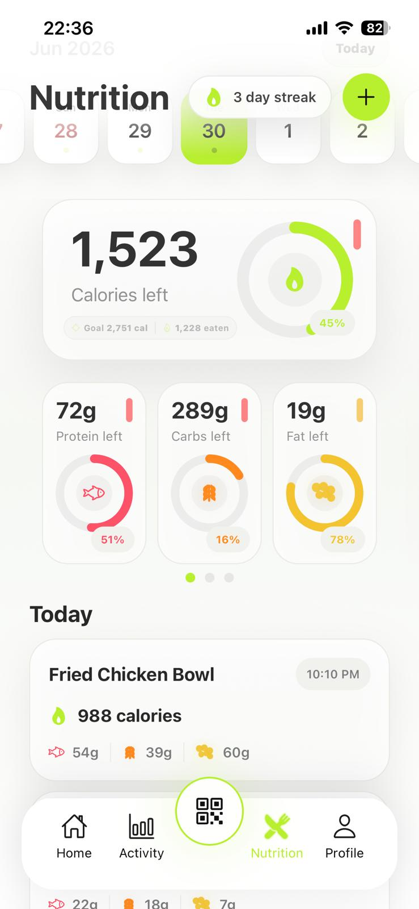
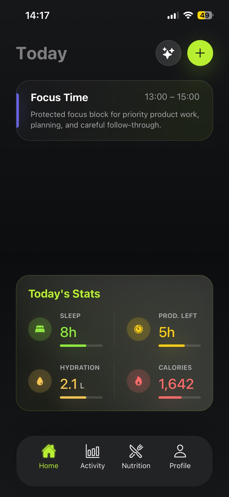
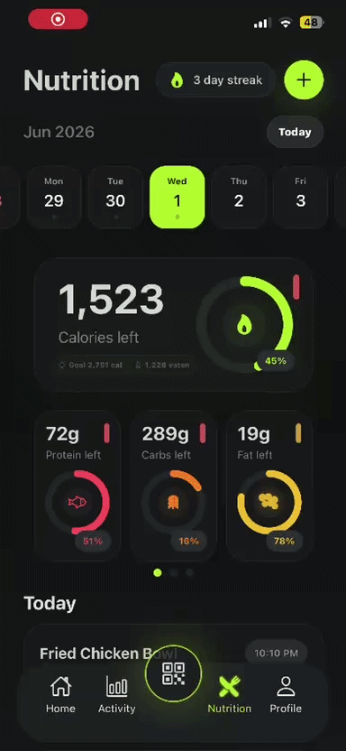

# HealthPro

A premium mobile health and productivity app built with Expo React Native.

## Overview

HealthPro combines activity planning, nutrition tracking, macro visualization, scanner flow concepts, and an AI Coach interface concept in a polished mobile UI. The project is designed as a personal mobile app project with a dark lime visual system, iOS polish, and web support through Expo.

## Features

- Today dashboard
- Activity planning and schedule cards
- Nutrition tracker
- Calorie, protein, carbs, and fat progress rings
- Macro composition / food balance visualization
- Scanner / QR nutrition lookup concept
- AI Coach modal UI concept
- Dark premium HealthPro visual system
- iOS and web responsive UI polish

## Tech Stack

- Expo
- React Native
- TypeScript
- React
- Expo Camera
- Expo Linear Gradient
- Expo Status Bar
- Expo Font
- @expo/vector-icons
- react-native-svg
- React Native Web

## Screenshots

| Home Dashboard | Activity Planning | Nutrition Tracker |
|---|---|---|
|  |  |  |

| Food Balance / AI Summary | Profile Goals | Light Mode Nutrition |
|---|---|---|
|  |  |  |

| Home Activity Card |
|---|
|  |

| QR Nutrition Lookup |
|---|
|  |

## Data Attribution

Food product data is provided by Open Food Facts. Open Food Facts data is available under the Open Database License (ODbL), and product images are licensed under Creative Commons Attribution ShareAlike. This project uses or plans to use Open Food Facts for barcode-based nutrition lookup.

This project is not officially affiliated with Open Food Facts.

## Setup

This project uses npm, detected from `package-lock.json`.

```powershell
npm install
npx expo start
```

Run on a target platform:

```powershell
npx expo start --ios
npx expo start --android
npx expo start --web
```

Type-check the project:

```powershell
npx tsc --noEmit
```

## Project Structure

- `src/screens` - main app screens such as Home, Activity, Nutrition, and Profile.
- `src/components` - reusable UI components, including shared visual elements.
- `src/styles` - centralized React Native styling for the HealthPro visual system.
- `src/constants` - theme values, layout constants, tabs, nutrition defaults, and sample data.
- `src/utils` - separated utility logic for dates, activities, formatting, nutrition, and health target calculations.
- `assets` - static app assets.
- `docs/screenshots` - placeholder folder for app screenshots.

## Maintainability

The project is structured as an active product prototype, with modular screens, shared styling, and separated utilities so future versions can be updated or expanded without rebuilding the app from scratch.

The screen-based structure makes individual app areas easier to update. Shared constants and styles help keep the visual system consistent across the experience. Utility functions are separated from UI where applicable, and future AI/backend features can be added without redesigning the current UI. The Expo React Native setup allows the app to evolve toward newer mobile versions over time.

## Status

Active personal project and product prototype.

## Future Improvements

- Modernized v2 with refined navigation, backend services, and production-ready AI Coach
- AI Coach backend integration
- Authentication
- Cloud sync
- Personalized user profiles
- Wearable integration
- Production analytics
- Improved nutrition scanner flow

## License

All rights reserved. Personal project by Sebastian.
